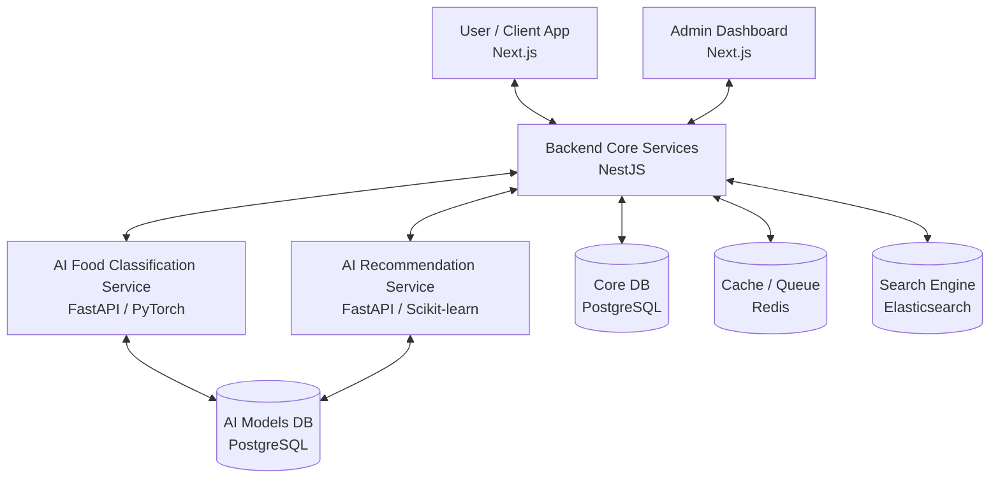

# 🍽️ AI Food Analytics & Recommendation Ecosystem

> An Advanced Microservices-based Platform for Food Recognition, Nutrition Tracking, and Personalized Recommendations.

## 📖 Overview

This repository acts as the **Meta-Repo** (Central Documentation and Structure) for the AI Food Analytics & Recommendation Ecosystem.
The system is designed to help users track their daily nutrition, identify food items through AI-powered image recognition, and receive personalized meal recommendations based on their health goals, BMI, and allergies.

---

## 🏗️ System Architecture

The project is broken down into several independent microservices.

---

## 🧩 Repositories (Microservices) Structure

This meta-repo is structured into two main domains: **Frontend (FE)** and **Backend (BE)**.

### 🖥️ Frontend (FE)

| Service                                                          | Tech Stack                   | Description                                                                                            | Location                                             |
| ---------------------------------------------------------------- | ---------------------------- | ------------------------------------------------------------------------------------------------------ | ---------------------------------------------------- |
| **[AI Food Client](https://github.com/quan2622/AI_Food_Client)** | Next.js, Zustand, Tailwind   | The main web application for end-users to log food, view reports, and get recommendations.             | [GitHub](https://github.com/quan2622/AI_Food_Client) |
| **[AI Food Admin](https://github.com/quan2622/AI_Food_Admin)**   | Next.js, Shadcn UI, Recharts | Administrative dashboard for managing users, monitoring system metrics, and controlling AI retraining. | [GitHub](https://github.com/quan2622/AI_Food_Admin)  |

### ⚙️ Backend & AI Services (BE)

| Service                                                                                       | Tech Stack                 | Description                                                                                           | Location                                                             |
| --------------------------------------------------------------------------------------------- | -------------------------- | ----------------------------------------------------------------------------------------------------- | -------------------------------------------------------------------- |
| **[Core Backend Services](https://github.com/quan2622/AI_Food_Backend_Services)**             | NestJS, Prisma, PostgreSQL | The main API gateway handling auth, user profiles, nutrition tracking, and Elasticsearch integration. | [GitHub](https://github.com/quan2622/AI_Food_Backend_Services)       |
| **[Food Classification Service](https://github.com/quan2622/AI_Food_Classification_Service)** | Python, FastAPI, PyTorch   | AI microservice responsible for identifying food items and extracting nutritional info from images.   | [GitHub](https://github.com/quan2622/AI_Food_Classification_Service) |
| **[Recommendation Service](https://github.com/quan2622/AI_Food_Recommendation_Service)**      | Python, FastAPI            | Hybrid recommendation engine suggesting meals based on user allergies, BMI, and health goals.         | [GitHub](https://github.com/quan2622/AI_Food_Recommendation_Service) |

---

## ✨ Core Features

1. **AI-Powered Image Recognition:** Upload a meal photo, and the system instantly identifies the food and calculates its nutritional value (Macros, Calories).
2. **Hybrid Recommendation Engine:** Get personalized daily meal suggestions based on body metrics, dietary goals, and allergen profiles.
3. **Daily Nutrition Tracking:** Log meals and compare daily intake against personalized nutritional targets.
4. **Continuous AI Training Pipeline:** Users can submit new food data, allowing administrators to seamlessly trigger AI model retraining jobs.
5. **High-Performance Search:** Sub-millisecond search capabilities powered by Elasticsearch and Redis caching.

---

## 🛠️ Tech Stack Summary

- **Frontend:** React, Next.js, TypeScript, Tailwind CSS, Zustand, Radix UI.
- **Backend:** Node.js, NestJS, TypeScript, PostgreSQL, Prisma ORM.
- **AI / ML:** Python, FastAPI, PyTorch, Scikit-learn.
- **Infrastructure & Tools:** Docker, Elasticsearch, Redis, Cloudinary, Gemini AI.

---

## 🚀 Getting Started

To run the entire ecosystem locally, please refer to the `README.md` files located in each individual service directory.

_Note: You will need Docker installed to spin up the required databases and caching layers easily._
